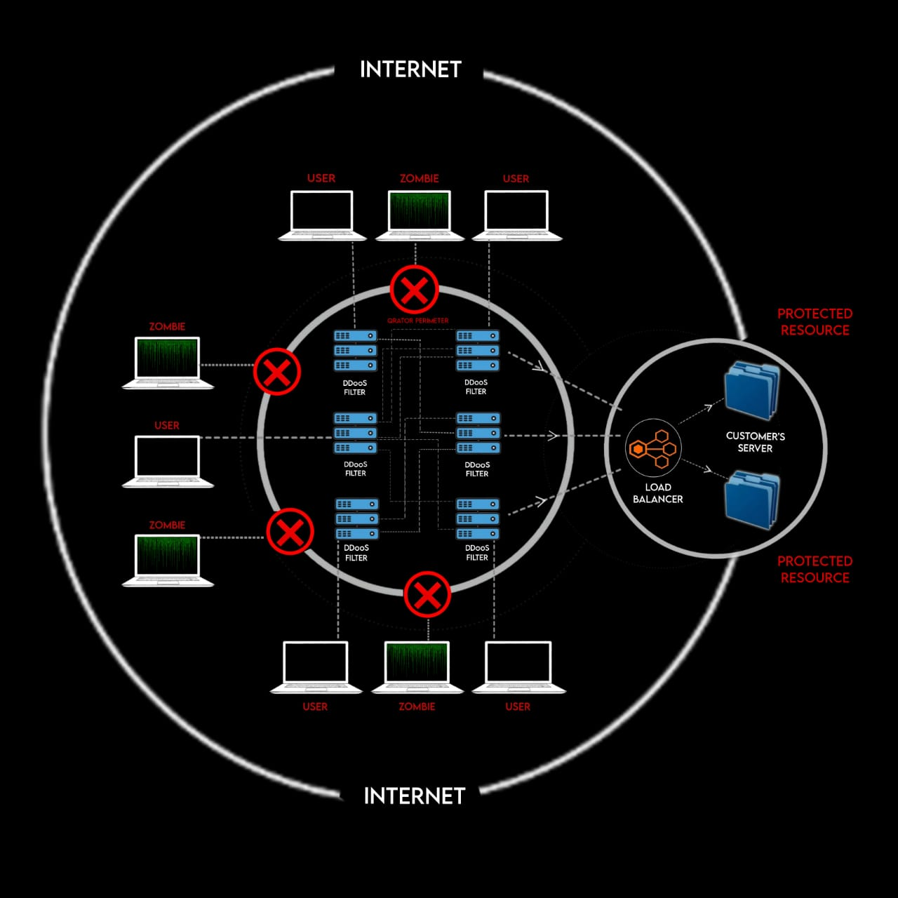
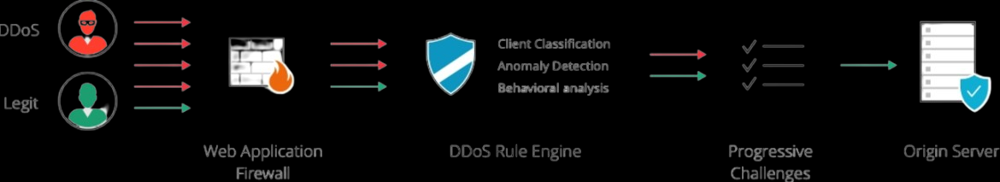
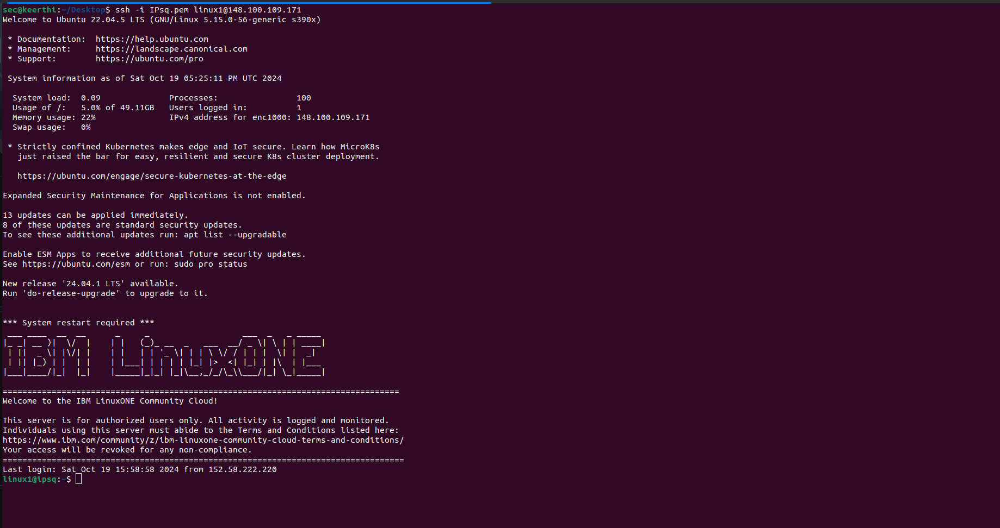
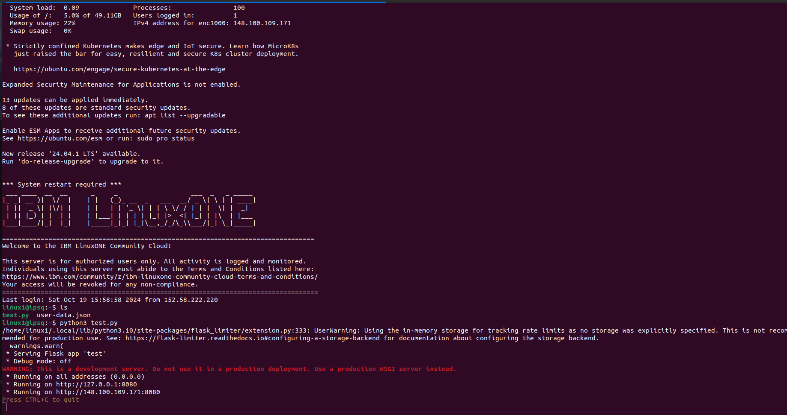
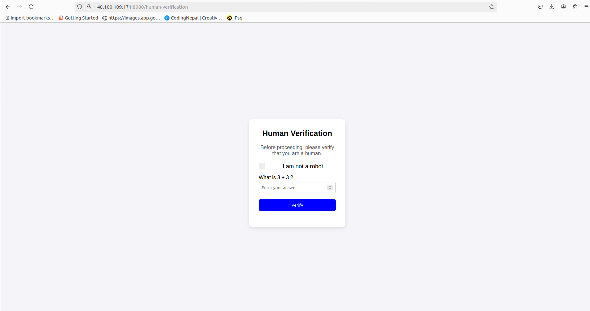
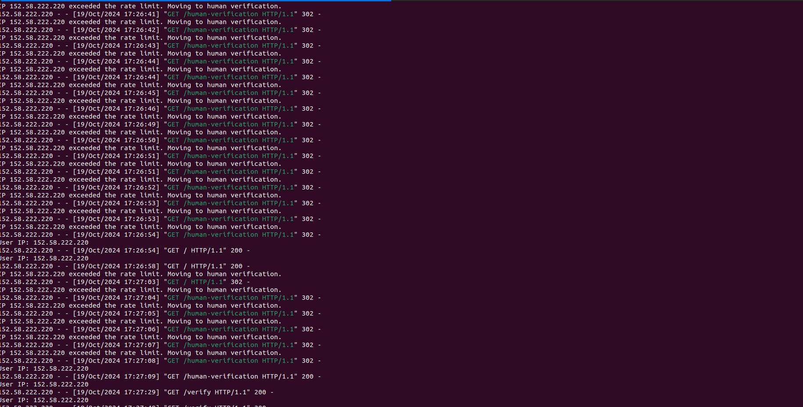
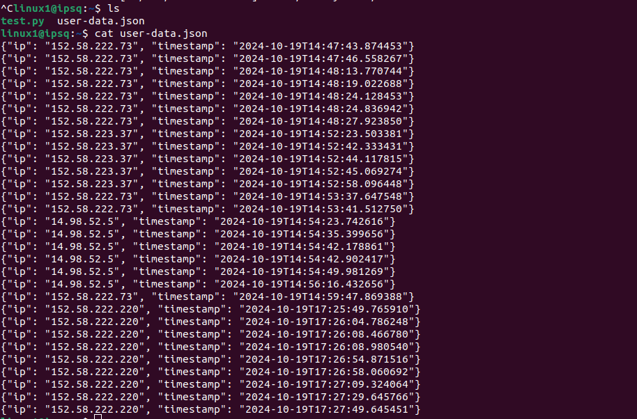
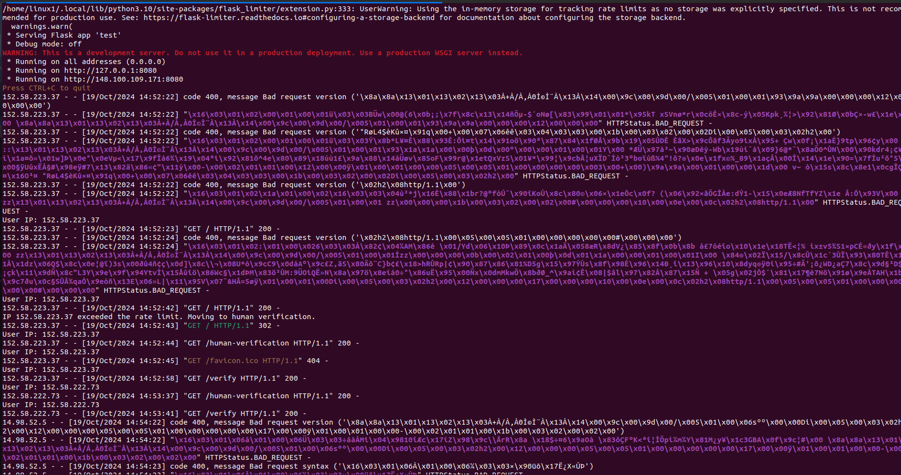

# DDoS-Protection-System-for-Cloud-Architecture

This project demonstrates a basic DDoS (Distributed Denial of Service) protection system built using Flask, Flask-Limiter, and Redis. It implements rate-limiting to prevent excessive requests from malicious users, and provides a simple human verification mechanism when the rate limit is exceeded.
# Technology Used


##  Features

- **Rate Limiting:** Limits the number of requests per minute from a single IP address using Flask-Limiter.
- **Redis Integration:** Logs IP addresses and request timestamps in a Redis database.
- **IP Logging:** Records user IPs and timestamps into a JSON file for further analysis.
- **Human Verification:** A simple verification page that requires either a checkbox confirmation or a simple math question to verify human users after exceeding the rate limit.
- **Flask-Limiter Integration:** Automatically handles rate limiting errors and redirects users to the human verification page.
## IDEA / SOLUTION

- **Traffic Control:** Monitor network traffic closely and set limits on request rates to prevent overwhelming your servers.
- **IP and Region Restriction:** Block traffic from known bad actors and regions to reduce the attack surface.
- **Web Application Firewall (WAF):** Use a WAF to filter out harmful requests before they reach your servers.
- **Cloud-Based Defense:** Leverage cloud services to distribute and absorb attack traffic, protecting your servers.
- **Dynamic Scaling:** Automatically adjust server capacity to handle increased load during attacks.

## Feasibility
- **Technological Feasibility:** The necessary technologies, such as firewalls, intrusion detection systems, and cloud-based DDoS mitigation services, are readily available and mature.
- **Infrastructure Compatibility:** Most existing network infrastructures can be adapted to accommodate DDoS protection measures, ensuring compatibility with current systems.

## Viability
- **Cost-Effectiveness:** While initial investments may be required, the long-
term benefits of preventing downtime and financial losses often outweigh the
costs.
- **Regulatory Compliance:** DDoS protection can help organizations meet
compliance requirements, especially in industries with strict data security
standards.
- **Competitive Advantage:** Implementing robust DDoS protection can enhance
reputation and customer trust, providing a competitive edge in the market.
## Project Structure

```bash
.
├── app.py                   # Main Flask app
├── requirements.txt          # Project dependencies
├── user-data.json            # Logs of user requests (IP and timestamp)
└── README.md                 # Project documentation
```

## Prerequisites

Before you can run the project, ensure you have the following installed:

- **Python 3.x**
- **Flask**
- **Redis**
- **Flask-Limiter**


### Dependencies in `requirements.txt`:

```go
Flask
Flask-Limiter
redis
```

### Code Overview
This file contains the core logic for rate-limiting and IP logging:
- **Flask-Limiter:** Limits the number of requests per minute from an IP to prevent DDoS attacks.
```python
limiter = Limiter(
    key_func=get_remote_address,
    app=app,
    default_limits=["2 per minute"]
)
```
- **IP Logging:** Records the user's IP address and the request timestamp in user-data.json
```python
@app.before_request
def log_ip():
    ip = request.remote_addr
    user_data = {"ip": ip, "timestamp": datetime.utcnow().isoformat()}
    log_user_data(user_data)

```
- **Human Verification Page:** Redirects users to a verification page when they exceed the rate limit.
```python
@app.errorhandler(429)
def ratelimit_error(e):
    return redirect('/human-verification')
```
# Benefits
- It impacts the webserver to be light weight and it reduces the DDoS attack from the attacker
- Using this method we can prevent upto 90% percent of DDoS attack

# RESEARCH AND REFERENCES
- Research on AI-driven anomaly detection in network security (IEEE, ACM).
- DDoS attack trends and defense mechanisms (e.g., machine learning behavior-based filtering) published in cybersecurity journals.
- Research on the effectiveness of rate limiting in preventing DDoS attacks (e.g., studies)
## Industry Reports 
- Global DDoS attack landscape reports from cybersecurity firms like **Akamai**, **Cloudflare**, and **Kaspersky**, showcasing evolving attack vectors and successful mitigations.
## Netflix Clone Website in the Demo
- The Netflix clone serves as a demonstration of what the user would see after successfully passing the DDoS protection measures (i.e., rate-limiting and human verification).
## WorkFlow



# Technical Output for the DDoS Protection System in Cloud Architecture
###  IP Logging Middleware

- **Purpose:** Logs user IP address with timestamps to monitor access patterns.
- **Key Functionality:**
      - `log_ip()` function captures the user's IP from request.`remote_addr`` and stores it in a JSON file.
  
  - **Example log data format:**
  ```json
  {
  "ip": "127.0.0.1",
  "timestamp": "2024-10-19T10:00:00Z" }
  ```

# Technical Output















